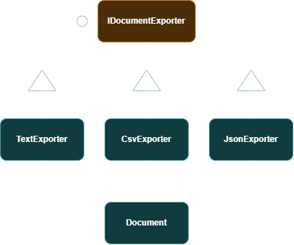

# CS5617 - Document Exporter

## Problem Statement

### A07 | SOLID - Liskov Substitution Principle | Document Exporters

> Design text, CSV, and JSON exporters that remain correct when used through one base contract.

#### Minimum Requirements

- State the contract clearly
- Implement at least three substitutable exporters
- Avoid unsupported-operation exceptions.
- Test every implementation with shared contract tests.

---

## Design Overview

The project uses a common interface:

Each exporter accepts the same `Document` and returns the exported representation as a `string` for the various formats (`Text / CSV / JSON`) .

The client depends only on `IDocumentExporter`, so any of the three implementations can be substituted without changing the client code.

This demonstrates the core idea of the **Liskov Substitution Principle**.

---


## Class Diagram



---

## Project Structure

```text
DocsExporter/
│
├── Exporter/
│   ├── CsvExporter.cs
│   ├── Document.cs
│   ├── IDocumentExporter.cs
│   ├── JsonExporter.cs
│   └── TextExporter.cs
│
├── Exporter.Tests/
│   ├── CsvExporterTest.cs
│   ├── ExporterContractTest.cs
│   ├── JsonExporterTest.cs
│   └── TextExporterTest.cs
│
└── DocsExporter.sln
```

## Build and Test

#### Build

```bash
cd DocsExporter
dotnet build
```

#### Run Tests

```bash
dotnet test
```

---

## Test Summaries

The project uses **MSTest** with a shared contract-test approach.

`ExporterContractTest` defines common behavior that every exporter must satisfy. Each concrete exporter inherits from the contract test and adds format-specific tests where required.

### Test Results

| Implementation |  Tests | Coverage Focus                                                                              |
| -------------- | -----: | ------------------------------------------------------------------------------------------- |
| `TextExporter` |      4 | Contract, normal export, empty rows, null document                                          |
| `CsvExporter`  |      9 | Contract, normal export, commas, quotes, newlines, empty rows, format empty string , normal value ,  null document              |
| `JsonExporter` |      8 | Contract,normal export ,  structure, valid JSON, special characters, empty title, empty rows, null document |
| **Total**      | **21** |                                                                                             |

---

## LSP Compliance

The design satisfies the **Liskov Substitution Principle** because all three exporters can be used through the same `IDocumentExporter` abstraction.

There are no implementations that reject the required `Export()` operation with `NotSupportedException`.

Each exporter provides a valid implementation of the common contract while producing output in its respective format.


Expected result:

```text
Passed! - Failed: 0, Passed: 21, Skipped: 0
```

---

## Critical Analysis

The design keeps the abstraction small and focused: `IDocumentExporter` defines only the operation that every exporter can meaningfully support.

Using a shared contract allows new exporters to be added without modifying existing implementations or client code.

The main **limitation** is that the project focuses specifically on demonstrating LSP rather than providing a complete production-level document-exporting framework.

---

### Environment

Made with Visual Studio 2022

---


